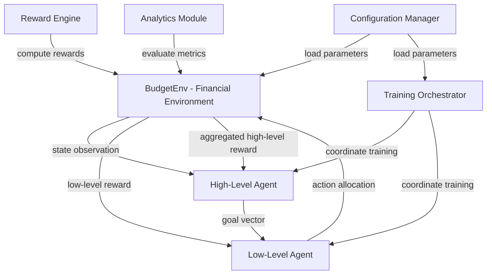

# Design Document

## Overview

The Personal Finance Optimization HRL System implements a hierarchical reinforcement learning architecture to optimize monthly salary allocation across investments, savings, and discretionary spending. The system consists of two cooperating agents: a High-Level Agent (Strategist) that sets medium-term financial goals, and a Low-Level Agent (Executor) that makes concrete monthly allocation decisions. The system is built on a custom Gymnasium environment that simulates realistic financial scenarios including fixed/variable expenses, inflation, and random economic events.

## Architecture

### System Components



### Component Responsibilities

| Component | Responsibility |
|-----------|---------------|
| **BudgetEnv** | Simulates monthly financial dynamics, manages state transitions, enforces constraints |
| **High-Level Agent** | Defines strategic goals every 6-12 months based on macro trends |
| **Low-Level Agent** | Executes monthly allocation decisions respecting strategic goals |
| **Reward Engine** | Computes multi-objective rewards balancing growth and stability |
| **Training Orchestrator** | Manages HRL training loop, coordinates policy updates |
| **Analytics Module** | Tracks and reports performance metrics |
| **Configuration Manager** | Loads and validates system parameters and behavioral profiles |

### Data Flow

1. **Initialization**: Configuration Manager loads parameters → BudgetEnv initializes state
2. **Strategic Planning**: High-Level Agent observes aggregated state → generates goal vector
3. **Tactical Execution**: Low-Level Agent receives state + goal → produces allocation action
4. **Environment Step**: BudgetEnv applies action → updates financial state → computes expenses
5. **Reward Computation**: Reward Engine calculates immediate and strategic rewards
6. **Policy Update**: Training Orchestrator updates agent policies based on experience
7. **Metrics Tracking**: Analytics Module records performance indicators

## Components and Interfaces

### BudgetEnv (Gymnasium Environment)

**Purpose**: Simulates the financial environment with realistic monthly dynamics

**State Space** (7-dimensional continuous):
```python
[
    income,              # Monthly salary (e.g., 3200)
    fixed_expenses,      # Fixed monthly costs (e.g., 1400)
    variable_expenses,   # Sampled variable costs (mean: 700)
    cash_balance,        # Current liquid funds
    inflation,           # Current inflation rate (e.g., 0.02)
    risk_tolerance,      # Agent's risk profile (0-1)
    t_remaining          # Months remaining in episode
]
```

**Action Space** (3-dimensional continuous, constrained to sum=1):
```python
[invest_ratio, save_ratio, consume_ratio]  # Each in [0, 1], sum = 1
```

**Key Methods**:
```python
def __init__(self, config: dict)
    # Initialize environment with configuration parameters
    
def reset(self) -> np.ndarray
    # Reset to initial state, return observation
    
def step(self, action: np.ndarray) -> tuple
    # Execute action, return (next_state, reward, done, info)
    
def _normalize_action(self, action: np.ndarray) -> np.ndarray
    # Ensure action sums to 1 via softmax
    
def _sample_variable_expense(self) -> float
    # Sample from distribution (e.g., normal with configured mean)
    
def _calculate_reward(self, invest: float, cash: float) -> float
    # Compute immediate reward based on allocation and stability
    
def _get_state(self) -> np.ndarray
    # Construct current state observation
```

### High-Level Agent (Strategist)

**Purpose**: Sets medium-term financial strategy based on macro trends

**Input**: Aggregated state features
```python
[
    avg_cash_last_n_months,
    avg_investment_return,
    spending_trend,
    current_wealth,
    months_elapsed
]
```

**Output**: Goal vector
```python
[
    target_invest_ratio,  # Desired investment percentage (0-1)
    safety_buffer,        # Minimum cash reserve target
    aggressiveness        # Risk appetite parameter (0-1)
]
```

**Interface**:
```python
class FinancialStrategist:
    def __init__(self, model: nn.Module, config: dict)
        # Initialize with neural network policy and configuration
        
    def select_goal(self, state: np.ndarray) -> np.ndarray
        # Generate goal vector from current state
        
    def learn(self, transitions: List[Transition]) -> dict
        # Update policy using HIRO/Option-Critic algorithm
        # Returns training metrics
        
    def aggregate_state(self, history: List[np.ndarray]) -> np.ndarray
        # Compute macro features from state history
```

### Low-Level Agent (Executor)

**Purpose**: Executes monthly allocation decisions respecting strategic goals

**Input**: Concatenated state and goal
```python
state_vector = [income, fixed, variable, cash, inflation, risk, t_remaining]
goal_vector = [target_invest, safety_buffer, aggressiveness]
input = concat(state_vector, goal_vector)  # 10-dimensional
```

**Output**: Action vector
```python
[invest_ratio, save_ratio, consume_ratio]  # Sums to 1
```

**Interface**:
```python
class BudgetExecutor:
    def __init__(self, model: nn.Module, config: dict)
        # Initialize with neural network policy and configuration
        
    def act(self, state: np.ndarray, goal: np.ndarray) -> np.ndarray
        # Generate allocation action from state and goal
        
    def learn(self, transitions: List[Transition]) -> dict
        # Update policy using PPO algorithm
        # Returns training metrics
```

### Reward Engine

**Purpose**: Computes multi-objective rewards for both agents

**Low-Level Reward Function**:
```python
r_low = α * invest_amount          # Encourage investment
        - β * max(0, threshold - cash)  # Penalize low cash
        - γ * overspend                 # Penalize excess consumption
        - δ * abs(min(0, cash))         # Penalize debt
```

**High-Level Reward Function**:
```python
r_high = Σ(r_low over period)      # Aggregate low-level rewards
         + λ * Δwealth              # Reward wealth growth
         + μ * stability_bonus      # Reward consistent positive balance
```

**Interface**:
```python
class RewardEngine:
    def __init__(self, config: dict)
        # Initialize with reward coefficients (α, β, γ, δ, λ, μ)
        
    def compute_low_level_reward(
        self, 
        action: np.ndarray, 
        state: np.ndarray, 
        next_state: np.ndarray
    ) -> float
        # Compute immediate monthly reward
        
    def compute_high_level_reward(
        self, 
        episode_history: List[Transition]
    ) -> float
        # Compute strategic reward over period
```

### Training Orchestrator

**Purpose**: Coordinates the HRL training loop with integrated analytics

**Status**: ✅ **IMPLEMENTED** - Fully functional with AnalyticsModule integration

**Training Loop**:
```python
for episode in range(num_episodes):
    # Reset analytics for new episode
    analytics.reset()
    
    state = env.reset()
    goal = high_agent.select_goal(state)
    episode_buffer = []
    
    for t in range(max_steps):
        # Low-level execution
        action = low_agent.act(state, goal)
        next_state, reward_low, done, info = env.step(action)
        
        # Record step in analytics
        invested_amount = action[0] * state[0]
        analytics.record_step(state, action, reward_low, goal, invested_amount)
        
        episode_buffer.append((state, goal, action, reward_low, next_state))
        
        # Update low-level policy
        if len(episode_buffer) >= batch_size:
            low_agent.learn(episode_buffer[-batch_size:])
        
        # High-level re-planning
        if t % high_period == 0:
            reward_high = reward_engine.compute_high_level_reward(episode_buffer)
            high_agent.learn([(state, goal, reward_high, next_state)])
            goal = high_agent.select_goal(next_state)
        
        state = next_state
        if done:
            break
    
    # Compute episode metrics
    metrics = analytics.compute_episode_metrics()
    # Store metrics in training history
```

**Interface**:
```python
class HRLTrainer:
    def __init__(
        self, 
        env: BudgetEnv, 
        high_agent: FinancialStrategist,
        low_agent: BudgetExecutor,
        reward_engine: RewardEngine,
        config: TrainingConfig
    )
        # Initialize training components
        # Creates AnalyticsModule instance automatically
        
    def train(self, num_episodes: int) -> dict
        # Execute training loop with automatic analytics tracking
        # Returns training history with all metrics
        
    def evaluate(self, num_episodes: int) -> dict
        # Run evaluation episodes without learning
        # Returns comprehensive evaluation summary with all 5 metrics
```

**Key Features**:
- Automatic AnalyticsModule integration (zero-overhead tracking)
- Records step data automatically during training
- Computes 5 key metrics per episode:
  - Cumulative wealth growth
  - Cash stability index
  - Sharpe-like ratio
  - Goal adherence
  - Policy stability
- Enhanced progress printing with stability and goal adherence
- Deterministic evaluation mode
- Comprehensive evaluation summary with mean/std statistics

### Analytics Module

**Purpose**: Tracks and computes performance metrics

**Status**: ✅ **IMPLEMENTED** - Fully functional with comprehensive metric computation

**Metrics Computed**:
- **Cumulative Wealth Growth**: Total invested capital (sum of invested_amounts)
- **Cash Stability Index**: Percentage of months with positive balance (0-1)
- **Sharpe-like Ratio**: Mean balance / std balance (risk-adjusted performance)
- **Goal Adherence**: Mean absolute difference between target_invest_ratio and actual invest action
- **Policy Stability**: Mean variance of actions over time (lower = more consistent)

**Implementation Details**:
```python
class AnalyticsModule:
    """
    Tracks and computes performance metrics for HRL financial system.
    
    Attributes:
        states: List of state observations
        actions: List of actions taken
        rewards: List of rewards received
        cash_balances: List of cash balances (extracted from state[3])
        goals: List of goal vectors from high-level agent
        invested_amounts: List of investment amounts per step
    """
    
    def __init__(self):
        """Initialize metric trackers"""
        self.states: List[np.ndarray] = []
        self.actions: List[np.ndarray] = []
        self.rewards: List[float] = []
        self.cash_balances: List[float] = []
        self.goals: List[np.ndarray] = []
        self.invested_amounts: List[float] = []
        
    def record_step(
        self, 
        state: np.ndarray, 
        action: np.ndarray, 
        reward: float,
        goal: Optional[np.ndarray] = None,
        invested_amount: Optional[float] = None
    ):
        """
        Record data from single step.
        
        Automatically extracts cash balance from state[3].
        Uses .copy() to prevent reference issues.
        """
        self.states.append(state.copy())
        self.actions.append(action.copy())
        self.rewards.append(float(reward))
        
        if len(state) >= 4:
            self.cash_balances.append(float(state[3]))
        
        if goal is not None:
            self.goals.append(goal.copy())
        
        if invested_amount is not None:
            self.invested_amounts.append(float(invested_amount))
        
    def compute_episode_metrics(self) -> Dict[str, float]:
        """
        Compute all metrics for completed episode.
        
        Returns dictionary with:
        - cumulative_wealth_growth: Sum of invested_amounts
        - cash_stability_index: positive_months / total_months
        - sharpe_ratio: mean_balance / std_balance
        - goal_adherence: mean(|goal[0] - action[0]|)
        - policy_stability: mean(var(actions))
        
        Handles edge cases (empty data, single data point).
        """
        # Implementation details in src/utils/analytics.py
        
    def reset(self):
        """Clear all episode data for new episode"""
        self.states.clear()
        self.actions.clear()
        self.rewards.clear()
        self.cash_balances.clear()
        self.goals.clear()
        self.invested_amounts.clear()
```

**Usage Example**:
```python
from src.utils.analytics import AnalyticsModule

analytics = AnalyticsModule()

# During episode
for step in episode:
    analytics.record_step(state, action, reward, goal, invested_amount)

# At episode end
metrics = analytics.compute_episode_metrics()
print(f"Wealth growth: ${metrics['cumulative_wealth_growth']:.2f}")
print(f"Stability: {metrics['cash_stability_index']:.2%}")
print(f"Sharpe ratio: {metrics['sharpe_ratio']:.2f}")
print(f"Goal adherence: {metrics['goal_adherence']:.4f}")
print(f"Policy stability: {metrics['policy_stability']:.4f}")

# Reset for next episode
analytics.reset()
```

**Edge Case Handling**:
- **Empty data**: Returns 0.0 for all metrics
- **Single step**: Handles correctly (stability=1.0 if positive cash, sharpe=0.0, policy_stability=0.0)
- **No goals recorded**: goal_adherence returns 0.0
- **Mismatched goal/action lengths**: Uses minimum length for computation
- **Zero variance**: Returns 0.0 for sharpe_ratio and policy_stability
- **Array references**: Uses .copy() to prevent reference issues

**Test Coverage**: ✅ **COMPREHENSIVE** - 18 test cases covering all functionality and edge cases

## Data Models

### Transition

Represents a single experience tuple for learning:
```python
@dataclass
class Transition:
    state: np.ndarray          # Current state
    goal: np.ndarray           # Strategic goal (for low-level)
    action: np.ndarray         # Action taken
    reward: float              # Reward received
    next_state: np.ndarray     # Resulting state
    done: bool                 # Episode termination flag
```

### Configuration Manager

**Status:** ✅ **FULLY IMPLEMENTED & TESTED** - Complete with YAML loading, behavioral profiles, validation, and 50+ test cases

**Location:** `src/utils/config_manager.py`

**Test Coverage:** ✅ **COMPREHENSIVE** - 50+ test cases in `tests/test_config_manager.py`

**Key Functions:**

```python
def load_config(yaml_path: str) -> Tuple[EnvironmentConfig, TrainingConfig, RewardConfig]:
    """
    Load configuration from YAML file.
    
    - Parses YAML configuration file
    - Creates EnvironmentConfig, TrainingConfig, RewardConfig instances
    - Validates all parameters
    - Raises ConfigurationError for invalid configurations
    """

def load_behavioral_profile(profile_name: str) -> Tuple[EnvironmentConfig, TrainingConfig, RewardConfig]:
    """
    Load predefined behavioral profile.
    
    - Supports "conservative", "balanced", "aggressive" profiles
    - Returns appropriate configuration with adjusted risk tolerance and reward coefficients
    - Uses BehavioralProfile enum
    """
```

**Usage:**
```python
from src.utils.config_manager import load_config, load_behavioral_profile

# Load from YAML
env_config, training_config, reward_config = load_config('configs/my_config.yaml')

# Load behavioral profile
env_config, training_config, reward_config = load_behavioral_profile('balanced')
```

**Validation:**
- Income must be positive
- Expenses must be non-negative
- Inflation must be in [-1, 1]
- Discount factors (gamma) must be in [0, 1]
- Risk tolerance must be in [0, 1]
- Learning rates must be positive
- All reward coefficients must be non-negative

**Test Coverage (50+ test cases):**
- ✅ Configuration loading (valid, partial, missing, empty, malformed YAML)
- ✅ Behavioral profiles (conservative, balanced, aggressive, case-insensitive, invalid)
- ✅ Environment validation (17 tests covering all parameters and boundary values)
- ✅ Training validation (13 tests covering all parameters and boundary values)
- ✅ Reward validation (8 tests covering all coefficients)
- ✅ Configuration overrides (profile + custom parameters)

### Configuration

System configuration parameters:
```python
@dataclass
class EnvironmentConfig:
    income: float = 3200
    fixed_expenses: float = 1400
    variable_expense_mean: float = 700
    variable_expense_std: float = 100
    inflation: float = 0.02
    safety_threshold: float = 1000
    max_months: int = 60
    initial_cash: float = 0
    risk_tolerance: float = 0.5

@dataclass
class TrainingConfig:
    num_episodes: int = 5000
    gamma_low: float = 0.95
    gamma_high: float = 0.99
    high_period: int = 6
    batch_size: int = 32
    learning_rate_low: float = 3e-4
    learning_rate_high: float = 1e-4
    
@dataclass
class RewardConfig:
    alpha: float = 10.0    # Investment reward coefficient
    beta: float = 0.1      # Stability penalty coefficient
    gamma: float = 5.0     # Overspend penalty coefficient
    delta: float = 20.0    # Debt penalty coefficient
    lambda_: float = 1.0   # Wealth growth coefficient
    mu: float = 0.5        # Stability bonus coefficient
```

### BehavioralProfile

Predefined risk profiles:
```python
class BehavioralProfile(Enum):
    CONSERVATIVE = {
        'risk_tolerance': 0.3,
        'safety_threshold': 1500,
        'reward_config': RewardConfig(alpha=5.0, beta=0.5)
    }
    BALANCED = {
        'risk_tolerance': 0.5,
        'safety_threshold': 1000,
        'reward_config': RewardConfig(alpha=10.0, beta=0.1)
    }
    AGGRESSIVE = {
        'risk_tolerance': 0.8,
        'safety_threshold': 500,
        'reward_config': RewardConfig(alpha=15.0, beta=0.05)
    }
```

## Error Handling

### Environment Errors

1. **Invalid Action**: If action doesn't sum to 1 or contains negative values
   - **Handling**: Apply softmax normalization automatically
   - **Logging**: Warn about invalid action

2. **Configuration Error**: Missing or invalid configuration parameters
   - **Handling**: Raise ValueError with descriptive message
   - **Validation**: Check all required parameters at initialization

3. **Numerical Instability**: Overflow/underflow in calculations
   - **Handling**: Clip values to reasonable ranges
   - **Logging**: Log warning when clipping occurs

### Training Errors

1. **Divergence**: Policy loss or rewards become NaN/Inf
   - **Handling**: Reset agent to last stable checkpoint
   - **Logging**: Save state before reset for debugging

2. **Memory Overflow**: Replay buffer exceeds memory limits
   - **Handling**: Implement circular buffer with fixed size
   - **Monitoring**: Track memory usage

3. **Episode Timeout**: Episode exceeds maximum steps
   - **Handling**: Terminate episode gracefully
   - **Metrics**: Track timeout rate

### Agent Errors

1. **Goal Infeasibility**: High-level goal cannot be achieved
   - **Handling**: Low-level agent does best effort
   - **Metrics**: Track goal adherence to detect systematic issues

2. **Model Loading Failure**: Cannot load saved model
   - **Handling**: Fall back to random initialization
   - **Logging**: Log error and continue with warning

## Testing Strategy

### Unit Tests

1. **BudgetEnv Tests**
   - Test state initialization and reset
   - Test action normalization
   - Test reward calculation with various scenarios
   - Test episode termination conditions
   - Test variable expense sampling distribution

2. **Agent Tests**
   - Test goal generation within valid ranges
   - Test action generation within valid ranges
   - Test policy update mechanics
   - Test state aggregation for high-level agent

3. **Reward Engine Tests**
   - Test low-level reward computation
   - Test high-level reward aggregation
   - Test penalty calculations
   - Test reward coefficient effects

### Integration Tests

1. **Training Loop Tests**
   - Test complete episode execution
   - Test high-level/low-level coordination
   - Test policy updates occur correctly
   - Test metrics collection

2. **Configuration Tests**
   - Test loading different behavioral profiles
   - Test parameter validation
   - Test configuration overrides

### Validation Tests

1. **Sanity Checks**
   - Random policy should not accumulate wealth
   - Conservative profile should maintain higher cash balance
   - Aggressive profile should invest more
   - Trained policy should outperform random policy

2. **Stability Tests**
   - Training should converge within expected episodes
   - Evaluation performance should be consistent
   - No memory leaks over long training runs

3. **Edge Cases**
   - Very low income scenarios
   - Very high expense scenarios
   - Extreme inflation rates
   - Maximum episode length

### Performance Tests

1. **Training Speed**
   - Measure steps per second
   - Profile computational bottlenecks
   - Test scalability with different configurations

2. **Memory Usage**
   - Monitor memory consumption during training
   - Test with different buffer sizes
   - Verify no memory leaks

## Implementation Notes

### Framework Selection

**Primary Framework**: Stable-Baselines3 with custom HRL wrapper
- **Rationale**: Mature PPO implementation, good documentation, easy to extend
- **Alternative**: RLlib for distributed training if needed later

### Neural Network Architecture

**Low-Level Policy**:
- Input: 10-dimensional (7 state + 3 goal)
- Hidden: [128, 128] with ReLU activation
- Output: 3-dimensional with softmax

**High-Level Policy**:
- Input: 5-dimensional (aggregated state)
- Hidden: [64, 64] with ReLU activation
- Output: 3-dimensional (goal vector)

### Hyperparameter Tuning

Priority parameters to tune:
1. Reward coefficients (α, β, γ, δ)
2. High-level decision period (6-12 months)
3. Discount factors (γ_low, γ_high)
4. Learning rates
5. Network architecture depth/width

### Logging and Monitoring

Use **Weights & Biases** or **TensorBoard** for:
- Training curves (rewards, losses)
- Episode metrics (wealth, stability)
- Action distributions
- Goal adherence over time
- Hyperparameter tracking

### Checkpointing

- Save models every N episodes
- Keep best model based on evaluation performance
- Save configuration with each checkpoint
- Enable resume from checkpoint
