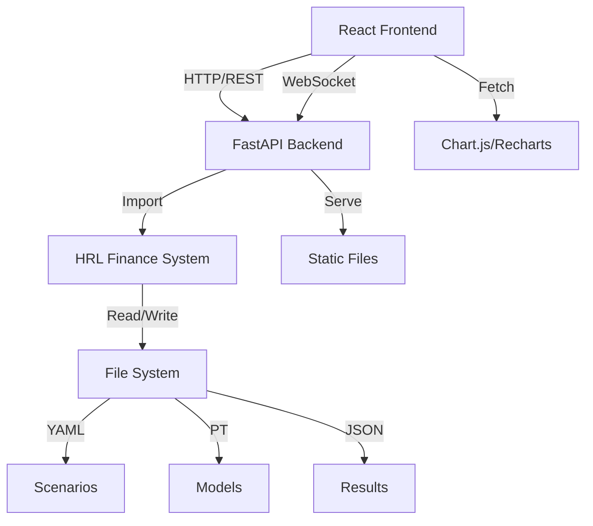

# Design Document - HRL Finance UI

## Overview

The HRL Finance UI is a full-stack web application consisting of a FastAPI backend and React frontend. The backend exposes the existing HRL Finance System through RESTful APIs and WebSocket connections, while the frontend provides an intuitive interface for scenario management, model training, simulation execution, and results visualization.

## Architecture

### System Components



### Technology Stack

| Layer | Technology | Purpose |
|-------|------------|---------|
| **Frontend** | React 18 | UI framework |
| | TypeScript | Type safety |
| | Tailwind CSS | Styling |
| | Recharts | Data visualization |
| | React Router | Navigation |
| | Axios | HTTP client |
| | Socket.IO Client | WebSocket |
| **Backend** | FastAPI | REST API framework |
| | Python 3.10+ | Language |
| | Pydantic | Data validation |
| | Socket.IO | WebSocket server |
| | Uvicorn | ASGI server |
| **Storage** | File System | Scenarios (YAML) |
| | File System | Models (PyTorch) |
| | File System | Results (JSON) |
| | SQLite (optional) | Metadata index |

## Components and Interfaces

### Backend API Structure

```
backend/
├── main.py                 # FastAPI application entry
├── api/
│   ├── scenarios.py        # Scenario CRUD endpoints
│   ├── training.py         # Training endpoints
│   ├── simulation.py       # Simulation endpoints
│   ├── results.py          # Results endpoints
│   └── reports.py          # Report generation endpoints
├── services/
│   ├── scenario_service.py # Scenario business logic
│   ├── training_service.py # Training orchestration
│   ├── simulation_service.py # Simulation execution
│   └── report_service.py   # Report generation
├── models/
│   ├── requests.py         # Pydantic request models
│   └── responses.py        # Pydantic response models
├── websocket/
│   └── training_socket.py  # WebSocket handlers
└── utils/
    ├── file_manager.py     # File I/O operations
    └── validators.py       # Input validation
```

### Frontend App Structure

```
frontend/
├── src/
│   ├── App.tsx             # Main app component
│   ├── pages/
│   │   ├── Dashboard.tsx   # Dashboard page
│   │   ├── ScenarioBuilder.tsx # Scenario creation/edit
│   │   ├── TrainingMonitor.tsx # Training view
│   │   ├── SimulationRunner.tsx # Simulation view
│   │   ├── ResultsViewer.tsx # Results visualization
│   │   └── Comparison.tsx  # Scenario comparison
│   ├── components/
│   │   ├── ScenarioCard.tsx # Scenario display card
│   │   ├── ModelCard.tsx   # Model display card
│   │   ├── MetricChart.tsx # Reusable chart component
│   │   ├── ProgressBar.tsx # Training progress
│   │   └── ReportModal.tsx # Report generation modal
│   ├── services/
│   │   ├── api.ts          # API client
│   │   └── websocket.ts    # WebSocket client
│   ├── types/
│   │   └── index.ts        # TypeScript interfaces
│   └── utils/
│       ├── formatters.ts   # Data formatting
│       └── validators.ts   # Form validation
├── public/
└── package.json
```

## Data Models

### API Request/Response Models

#### Scenario Configuration

```python
class ScenarioConfig(BaseModel):
    name: str
    description: Optional[str]
    environment: EnvironmentConfig
    training: TrainingConfig
    reward: RewardConfig

class EnvironmentConfig(BaseModel):
    income: float = Field(gt=0)
    fixed_expenses: float = Field(ge=0)
    variable_expense_mean: float = Field(ge=0)
    variable_expense_std: float = Field(ge=0)
    inflation: float = Field(ge=-1, le=1)
    safety_threshold: float = Field(ge=0)
    max_months: int = Field(gt=0)
    initial_cash: float = Field(ge=0)
    risk_tolerance: float = Field(ge=0, le=1)
    investment_return_mean: float = 0.005
    investment_return_std: float = 0.02
    investment_return_type: str = "stochastic"
```

#### Training Request

```python
class TrainingRequest(BaseModel):
    scenario_name: str
    num_episodes: int = Field(gt=0, default=1000)
    save_interval: int = Field(gt=0, default=100)
    eval_episodes: int = Field(gt=0, default=10)
    seed: Optional[int] = None
```

#### Training Progress Update

```python
class TrainingProgress(BaseModel):
    episode: int
    total_episodes: int
    avg_reward: float
    avg_duration: float
    avg_cash: float
    avg_invested: float
    stability: float
    goal_adherence: float
    elapsed_time: float
```

#### Simulation Request

```python
class SimulationRequest(BaseModel):
    model_name: str
    scenario_name: str
    num_episodes: int = Field(gt=0, default=10)
    seed: Optional[int] = None
```

#### Simulation Results

```python
class SimulationResults(BaseModel):
    scenario_name: str
    model_name: str
    num_episodes: int
    duration_mean: float
    duration_std: float
    final_cash_mean: float
    final_invested_mean: float
    final_portfolio_mean: float
    total_wealth_mean: float
    investment_gains_mean: float
    avg_invest_pct: float
    avg_save_pct: float
    avg_consume_pct: float
    episodes: List[EpisodeResult]
```

### Frontend TypeScript Interfaces

```typescript
interface Scenario {
  name: string;
  description?: string;
  environment: EnvironmentConfig;
  training: TrainingConfig;
  reward: RewardConfig;
  createdAt: string;
  updatedAt: string;
}

interface Model {
  name: string;
  scenarioName: string;
  episodes: number;
  finalReward: number;
  finalStability: number;
  trainedAt: string;
}

interface SimulationResult {
  scenarioName: string;
  modelName: string;
  durationMean: number;
  totalWealthMean: number;
  investmentGainsMean: number;
  avgInvestPct: number;
  avgSavePct: number;
  avgConsumePct: number;
  episodes: EpisodeData[];
}

interface EpisodeData {
  months: number[];
  cash: number[];
  invested: number[];
  portfolioValue: number[];
  actions: number[][];
}
```

## API Endpoints

### Scenarios API

```
GET    /api/scenarios              # List all scenarios
GET    /api/scenarios/{name}       # Get scenario details
POST   /api/scenarios              # Create new scenario
PUT    /api/scenarios/{name}       # Update scenario
DELETE /api/scenarios/{name}       # Delete scenario
GET    /api/scenarios/templates    # Get preset templates
```

### Training API

```
POST   /api/training/start         # Start training
POST   /api/training/stop          # Stop training
GET    /api/training/status        # Get training status
WS     /ws/training                # WebSocket for real-time updates
```

### Simulation API

```
POST   /api/simulation/run         # Run simulation
GET    /api/simulation/results/{id} # Get simulation results
GET    /api/simulation/history     # List past simulations
```

### Models API

```
GET    /api/models                 # List all trained models
GET    /api/models/{name}          # Get model details
DELETE /api/models/{name}          # Delete model
```

### Reports API

```
POST   /api/reports/generate       # Generate report
GET    /api/reports/{id}           # Download report
GET    /api/reports/list           # List generated reports
```

## User Interface Design

### Dashboard Layout

```
┌─────────────────────────────────────────────────────────┐
│ HRL Finance System                    [Theme] [Settings] │
├─────────────────────────────────────────────────────────┤
│ ┌─────────────┐ ┌─────────────┐ ┌─────────────┐        │
│ │ Scenarios   │ │ Models      │ │ Simulations │        │
│ │     12      │ │      8      │ │     24      │        │
│ └─────────────┘ └─────────────┘ └─────────────┘        │
│                                                          │
│ Recent Scenarios                    [+ New Scenario]    │
│ ┌──────────────────────────────────────────────────┐   │
│ │ Benedetta Case                          36.5%    │   │
│ │ Young professional with owned home                │   │
│ │ Last trained: 2 hours ago              [Train]   │   │
│ └──────────────────────────────────────────────────┘   │
│ ┌──────────────────────────────────────────────────┐   │
│ │ Bologna Coppia                          18.8%    │   │
│ │ Young couple with rental                          │   │
│ │ Last trained: 1 day ago                [Train]   │   │
│ └──────────────────────────────────────────────────┘   │
│                                                          │
│ Recent Activity                                          │
│ • Training completed: Benedetta Case (1000 episodes)    │
│ • Simulation run: Milano Senior (10 episodes)           │
│ • Report generated: Benedetta Technical Report          │
└─────────────────────────────────────────────────────────┘
```

### Scenario Builder Layout

```
┌─────────────────────────────────────────────────────────┐
│ ← Back to Dashboard          Create New Scenario        │
├─────────────────────────────────────────────────────────┤
│ ┌─────────────────────┐ ┌─────────────────────────────┐│
│ │ Basic Information   │ │ Preview                     ││
│ │                     │ │                             ││
│ │ Name: [________]    │ │ Monthly Cash Flow           ││
│ │ Description:        │ │ ┌─────────────────────────┐ ││
│ │ [____________]      │ │ │ Income:      2,000 EUR  │ ││
│ │                     │ │ │ Fixed:        -770 EUR  │ ││
│ │ Templates:          │ │ │ Variable:     -500 EUR  │ ││
│ │ [Conservative ▼]    │ │ │ Available:     730 EUR  │ ││
│ │                     │ │ │ (36.5%)                 │ ││
│ ├─────────────────────┤ │ └─────────────────────────┘ ││
│ │ Environment         │ │                             ││
│ │                     │ │ Risk Profile: High          ││
│ │ Income: [2000] EUR  │ │ Sustainability: TBD         ││
│ │ Fixed: [770] EUR    │ │                             ││
│ │ Variable: [500±120] │ │                             ││
│ │ Inflation: [2.0]%   │ │                             ││
│ │ Buffer: [5000] EUR  │ │                             ││
│ │                     │ │                             ││
│ ├─────────────────────┤ │                             ││
│ │ Investment Returns  │ │                             ││
│ │ Type: [Stochastic▼] │ │                             ││
│ │ Mean: [0.5]% month  │ │                             ││
│ │ Std: [2.0]% month   │ │                             ││
│ └─────────────────────┘ └─────────────────────────────┘│
│                                                          │
│                          [Cancel] [Save Scenario]       │
└─────────────────────────────────────────────────────────┘
```

### Training Monitor Layout

```
┌─────────────────────────────────────────────────────────┐
│ ← Back                Training: Benedetta Case          │
├─────────────────────────────────────────────────────────┤
│ Status: Training  Episode 450/1000  Elapsed: 5m 23s     │
│ ┌─────────────────────────────────────────────────────┐ │
│ │ ████████████████████░░░░░░░░░░░░░░░░░░░░░░░░░ 45%  │ │
│ └─────────────────────────────────────────────────────┘ │
│                                                          │
│ Current Metrics                                          │
│ ┌──────────────┐ ┌──────────────┐ ┌──────────────┐    │
│ │ Avg Reward   │ │ Duration     │ │ Stability    │    │
│ │   168.5      │ │  118.2 mo    │ │   98.5%      │    │
│ └──────────────┘ └──────────────┘ └──────────────┘    │
│                                                          │
│ Training Progress                                        │
│ ┌─────────────────────────────────────────────────────┐ │
│ │ Reward ▲                                            │ │
│ │ 200 │                                    ╱──────    │ │
│ │ 150 │                          ╱────────╱          │ │
│ │ 100 │                ╱────────╱                    │ │
│ │  50 │      ╱────────╱                              │ │
│ │   0 └──────────────────────────────────────────►  │ │
│ │       0    200   400   600   800  1000  Episode   │ │
│ └─────────────────────────────────────────────────────┘ │
│                                                          │
│                    [Pause] [Stop Training]              │
└─────────────────────────────────────────────────────────┘
```

### Results Viewer Layout

```
┌─────────────────────────────────────────────────────────┐
│ ← Back        Results: Benedetta Case - 10 Episodes     │
├─────────────────────────────────────────────────────────┤
│ Summary Statistics                                       │
│ ┌──────────┐ ┌──────────┐ ┌──────────┐ ┌──────────┐   │
│ │ Duration │ │ Wealth   │ │ Invested │ │ Returns  │   │
│ │ 27 ± 1.3 │ │ 18,842   │ │ 18,000   │ │ +1,178   │   │
│ │  months  │ │   EUR    │ │   EUR    │ │   EUR    │   │
│ └──────────┘ └──────────┘ └──────────┘ └──────────┘   │
│                                                          │
│ [Cash Balance] [Portfolio] [Wealth] [Actions]           │
│ ┌─────────────────────────────────────────────────────┐ │
│ │ Cash Balance Over Time                              │ │
│ │ 6000 │                                              │ │
│ │ 4000 │ ╲                                            │ │
│ │ 2000 │  ╲___                                        │ │
│ │    0 │      ╲___                                    │ │
│ │-2000 │          ╲___                                │ │
│ │      └──────────────────────────────────────────►  │ │
│ │        0    5    10   15   20   25   Months       │ │
│ └─────────────────────────────────────────────────────┘ │
│                                                          │
│ Strategy Learned                                         │
│ ┌─────────────────────────────────────────────────────┐ │
│ │ Invest: 33.3% (667 EUR/month)                       │ │
│ │ Save:   33.3% (667 EUR/month)                       │ │
│ │ Consume: 33.3% (667 EUR/month)                      │ │
│ └─────────────────────────────────────────────────────┘ │
│                                                          │
│              [Compare] [Generate Report] [Export]       │
└─────────────────────────────────────────────────────────┘
```

## Error Handling

### Backend Error Responses

```python
class ErrorResponse(BaseModel):
    error: str
    message: str
    details: Optional[Dict] = None
    timestamp: str

# HTTP Status Codes
200: Success
201: Created
400: Bad Request (validation error)
404: Not Found
409: Conflict (duplicate name)
500: Internal Server Error
503: Service Unavailable (training in progress)
```

### Frontend Error Handling

- Display toast notifications for API errors
- Show inline validation errors in forms
- Provide retry mechanisms for failed requests
- Log errors to console for debugging
- Graceful degradation for missing data

## Testing Strategy

### Backend Tests

1. **Unit Tests**:
   - Test API endpoint handlers
   - Test service layer business logic
   - Test data validation with Pydantic
   - Test file I/O operations

2. **Integration Tests**:
   - Test complete API workflows
   - Test WebSocket communication
   - Test training orchestration
   - Test report generation

### Frontend Tests

1. **Component Tests**:
   - Test individual React components
   - Test form validation
   - Test chart rendering
   - Test user interactions

2. **E2E Tests**:
   - Test complete user workflows
   - Test scenario creation to simulation
   - Test training monitoring
   - Test report generation

## Deployment

### Development

```bash
# Backend
cd backend
uvicorn main:app --reload --port 8000

# Frontend
cd frontend
npm run dev
```

### Production

```bash
# Backend (with Gunicorn)
gunicorn -w 4 -k uvicorn.workers.UvicornWorker main:app

# Frontend (build and serve)
npm run build
serve -s build
```

### Docker Deployment

```dockerfile
# Multi-stage build
FROM python:3.10 AS backend
WORKDIR /app/backend
COPY backend/requirements.txt .
RUN pip install -r requirements.txt
COPY backend/ .

FROM node:18 AS frontend
WORKDIR /app/frontend
COPY frontend/package.json .
RUN npm install
COPY frontend/ .
RUN npm run build

FROM python:3.10-slim
WORKDIR /app
COPY --from=backend /app/backend /app/backend
COPY --from=frontend /app/frontend/build /app/frontend/build
EXPOSE 8000
CMD ["uvicorn", "backend.main:app", "--host", "0.0.0.0", "--port", "8000"]
```

## Security Considerations

1. **Input Validation**: All user inputs validated with Pydantic
2. **File Access**: Restrict file operations to designated directories
3. **CORS**: Configure allowed origins for production
4. **Rate Limiting**: Implement rate limiting for API endpoints
5. **Authentication** (future): Add user authentication and authorization
6. **Data Sanitization**: Sanitize file names and paths

## Performance Optimization

1. **Caching**: Cache scenario and model metadata
2. **Lazy Loading**: Load charts and data on demand
3. **Pagination**: Paginate large lists of scenarios/models
4. **Compression**: Enable gzip compression for API responses
5. **Code Splitting**: Split frontend bundle by route
6. **WebSocket Throttling**: Limit training update frequency

## Accessibility

1. **Keyboard Navigation**: All interactive elements accessible via keyboard
2. **Screen Readers**: Proper ARIA labels and semantic HTML
3. **Color Contrast**: WCAG 2.1 AA compliant color schemes
4. **Focus Indicators**: Clear focus states for all interactive elements
5. **Alternative Text**: Descriptive alt text for charts and images
6. **Responsive Design**: Mobile-friendly layouts
